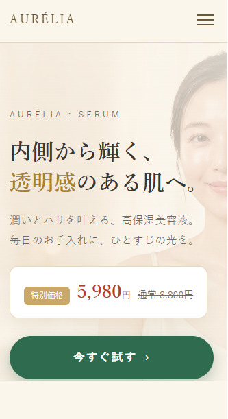

# AURÉLIA — 美容液ブランド ランディングページ

高保湿美容液ブランド「AURÉLIA」のランディングページ。トップ＋下層8ページの静的サイト一式。

## 🔗 公開サイト
https://sleepycat12341013.github.io/aurelia-lp/

## 特徴
- 素の HTML / CSS / Vanilla JS（フレームワーク不使用）
- **デスクトップ・モバイル両対応**（レスポンシブ設計。スマホはハンバーガーメニュー＋ヒーロー画像をモバイル専用に最適化）
- フルブリードのヒーロー（画像3枚クロスフェード）、スクロール演出、FAQ 開閉
- 用途別に最適化した軽量画像
- お問い合わせ／購入フォームはデモ動作（送信は行われない）

## ページ構成
| ページ | 内容 |
|---|---|
| index | 商品トップ |
| problem | 肌悩み・ベネフィット |
| story | ブランドストーリー |
| howto | 使い方 |
| quality | 品質・成分 |
| pricing | 価格・FAQ |
| company / privacy / contact | 会社概要・プライバシー・お問い合わせ |

## 閲覧方法
上記の公開サイトを開く。ローカルでは `index.html` をブラウザで開く（または VS Code の Live Server など）。

---
Design & build: cmalu ractu

※デモ用サイトです。掲載の会社情報・成分・効能表現はサンプルであり、実在の商品・企業とは関係ありません。
